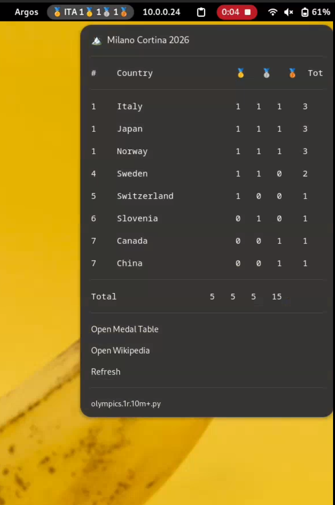

# Olympic Medal Tracker for GNOME

A lightweight [Argos](https://github.com/p-e-w/argos) plugin that scrapes 2026 Winter Olympics medal counts from Wikipedia and displays them in your GNOME top bar.


## Features

- 🏔️ Live medal counts for the Milano Cortina 2026 Winter Olympics
- 📊 Full medal table dropdown with all competing nations
- 🇺🇸 Highlights your country in the top bar (configurable)
- 🔄 Auto-refreshes every 10 minutes (configurable via filename)
- 📡 Uses the Wikipedia MediaWiki API — no authentication or API keys needed
- 🪶 Zero dependencies beyond Python 3 standard library

## Screenshot



## Prerequisites

- GNOME Shell (Fedora, Ubuntu, Arch, etc.)
- [Argos extension](https://github.com/p-e-w/argos)
- Python 3.6+

## Installation

### 1. Install Argos

**Fedora:**
```bash
sudo dnf install gnome-shell-extension-argos
```

**From source (other distros):**
```bash
git clone https://github.com/p-e-w/argos.git
cp -r argos/argos@pew.worldwidemann.com ~/.local/share/gnome-shell/extensions/
```

Enable the extension (you may need to log out and back in first):
```bash
gnome-extensions enable argos@pew.worldwidemann.com
```

### 2. Install the plugin

```bash
mkdir -p ~/.config/argos
cp olympics.1r.10m+.py ~/.config/argos/
chmod +x ~/.config/argos/olympics.1r.10m+.py
```

It should appear in your top bar immediately. If not, restart GNOME Shell (log out/in, or `Alt+F2` → `r` → `Enter` on X11).

### 3. Test it standalone

```bash
python3 ~/.config/argos/olympics.1r.10m+.py
```

## Configuration

### Change your country

Edit the plugin and change the `MY_COUNTRY` variable to your [IOC country code](https://en.wikipedia.org/wiki/List_of_IOC_country_codes):

```python
MY_COUNTRY = "USA"   # Change to your country's IOC code
```

Common codes: `USA`, `CAN`, `GBR`, `GER`, `NOR`, `SWE`, `FRA`, `JPN`, `AUS`, `ITA`, `SUI`, `NED`, `KOR`, `CHN`

### Change refresh interval

The refresh interval is controlled by the filename. Rename the file to change it:

| Filename | Refresh Rate |
|---|---|
| `olympics.1r.5m+.py` | Every 5 minutes |
| `olympics.1r.10m+.py` | Every 10 minutes (default) |
| `olympics.1r.30m+.py` | Every 30 minutes |
| `olympics.1r.1h+.py` | Every hour |

The `+` means it also refreshes when you open the dropdown.

### Change position

The position is also in the filename:

| Position | Meaning |
|---|---|
| `0l` | Far left (before Activities) |
| `0r` | Just right of Activities |
| `1c` | Just right of the clock |
| `1r` | Right side, after clock (default) |

## How it works

The plugin queries the [Wikipedia MediaWiki API](https://www.mediawiki.org/wiki/API:Main_page) to fetch the wikitext of the [2026 Winter Olympics medal table](https://en.wikipedia.org/wiki/2026_Winter_Olympics_medal_table) article. It parses the structured template data (e.g., `| gold_NOR = 1 | silver_NOR = 1 | bronze_NOR = 1`) using regex, which is far more reliable than HTML scraping.

Wikipedia editors keep the medal table updated in near real-time during the Games, so the data is typically only a few minutes behind the official results.

## Standalone CLI usage

The repo also includes `olympic_medals_v2.py`, a standalone CLI tool:

```bash
# Pretty-printed table
python3 olympic_medals_v2.py

# JSON output
python3 olympic_medals_v2.py --json

# Top 5 countries
python3 olympic_medals_v2.py --top 5

# Filter by country
python3 olympic_medals_v2.py --country norway

# Single-line output
python3 olympic_medals_v2.py --oneline
```

## Adapting for future Olympics

To reuse this for future Games, update the `API_URL` in the script to point to the relevant Wikipedia article. The wikitext medal table format has been consistent across Olympics:

```python
# For LA 2028 Summer Olympics (when the article exists):
API_URL = (
    "https://en.wikipedia.org/w/api.php"
    "?action=parse"
    "&page=2028_Summer_Olympics_medal_table"
    "&prop=wikitext"
    "&section=2"    # May need to adjust the section number
    "&format=json"
)
```

